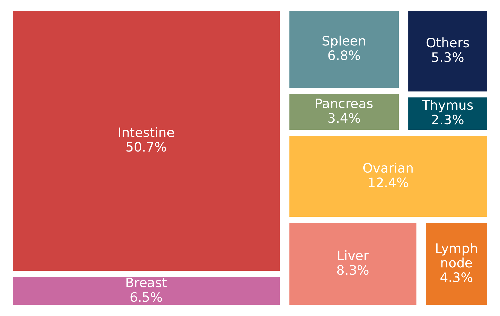

Introduction
============

Welcome to the documentation of **Spatium**, a Python package for spatial proteomics data analysis based on our pretrained foundation model.

This package is developed based on our work of **Spatium** (citation). In this documentation, we provide a comprehensive guide for using Spatium, including model initialization, data preprocessing, representation extraction, downstream analysis, and visualization examples. Through these tutorials, users can easily apply Spatium to various spatial proteomics datasets and explore biologically meaningful spatial patterns.

Spatium is a foundation model pretrained on large-scale and diverse spatial proteomics datasets. The model was trained using more than **51 million spatially resolved cells** collected from **70 human spatial proteomics studies**, covering multiple experimental platforms, including **CODEX, imaging mass cytometry (IMC), cyclic immunofluorescence (CyCIF), and multiplexed ion beam imaging (MIBI)**. The pretraining datasets encompass **18 human tissues** and **18 disease conditions**, enabling Spatium to learn generalizable representations of cellular states, tissue architectures, and spatial organizations across diverse biological contexts.

Inspired by recent advances in foundation models for single-cell analysis, Spatium adopts a transformer-based architecture to capture complex relationships between cellular features and their spatial context. Through large-scale generative pretraining, Spatium learns transferable representations that can be efficiently adapted to a variety of downstream spatial proteomics tasks, including cell type annotation, spatial neighborhood analysis, and tissue microenvironment characterization.

To facilitate broad adoption and integration with existing single-cell analysis workflows, the Spatium package is fully compatible with the **AnnData** data structure and integrates seamlessly with the **Scanpy** ecosystem. Users can directly utilize Spatium-derived embeddings together with established single-cell analysis pipelines for dimensionality reduction, clustering, spatial visualization, and downstream biological interpretation.

In addition to the core functions provided by this package, we provide comprehensive tutorials demonstrating how to apply Spatium for spatial proteomics data analysis. These tutorials include step-by-step instructions for data preparation, model loading, feature extraction, downstream task analysis, and visualization. The examples are designed to help users quickly incorporate Spatium into their existing spatial omics workflows.