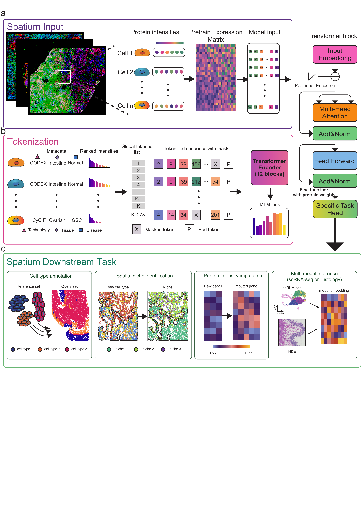

Spatium documentation
=====================

Welcome to Spatium documentation. All the code can be found from https://github.com/ploughhh/Spatium.

Spatium is a foundation model for spatial proteomics that enables
representation learning, cell type annotation, spatial niche analysis,
protein imputation, multimodal inference, and downstream fine-tuning
across diverse spatial proteomics datasets.

For information about the model architecture, pretraining datasets,
benchmarking results, and citation information, please refer to
the :doc:`Introduction` page.

To install Spatium and configure the required environment, please refer
to the :doc:`installation` page.

For examples of protein tokenization and data preprocessing, please refer
to the :doc:`tokenizer` page.

We also provide complete analysis workflows, covering the process from
input spatial proteomics data to downstream model outputs. These tutorials
will guide users through practical applications of Spatium. Please refer to
the :doc:`tutorials` page.

.. toctree::
   :maxdepth: 2
   :titlesonly:
   :caption: Contents:

   Introduction
   installation
   tokenizer
   fine_tune_train
   tutorials

